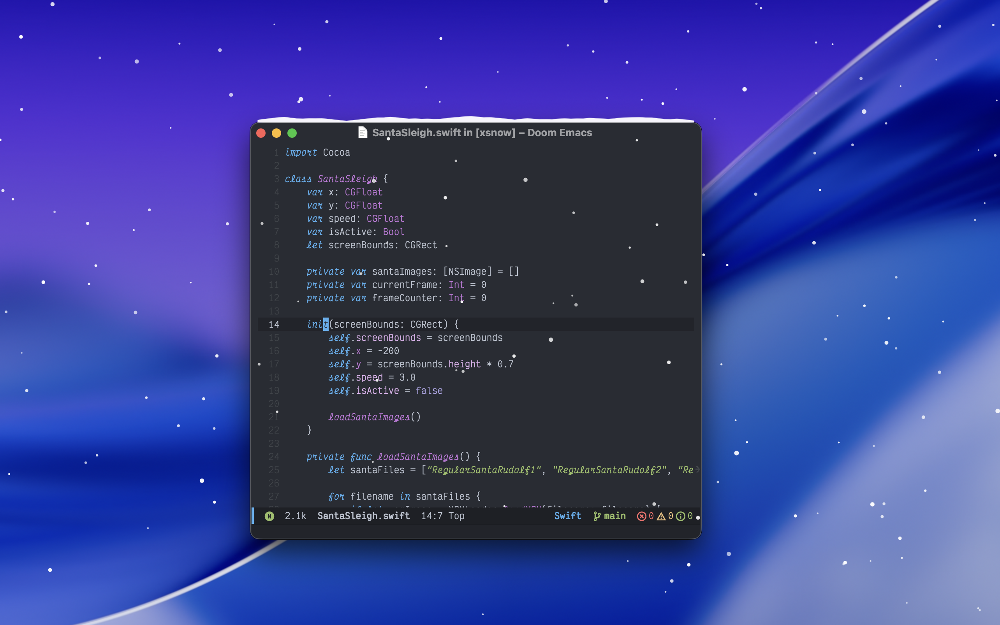

# xsnow for MacOS

Vibe coded xmas nostalgia for the Apple operating system.



## Features

## Requirements

- macOS 11.0 (Big Sur) or later
- Xcode Command Line Tools (for building from source)

## Installation

### Option 1: Build from Source

```bash
# Build the application
make

# Run without installing
make run

# Install to Applications folder
make install
```

